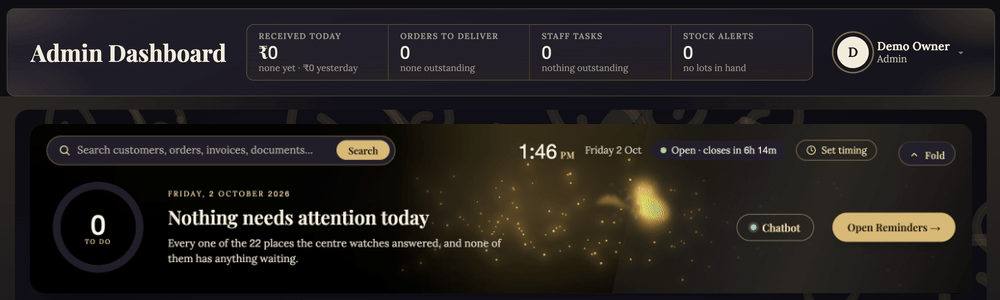
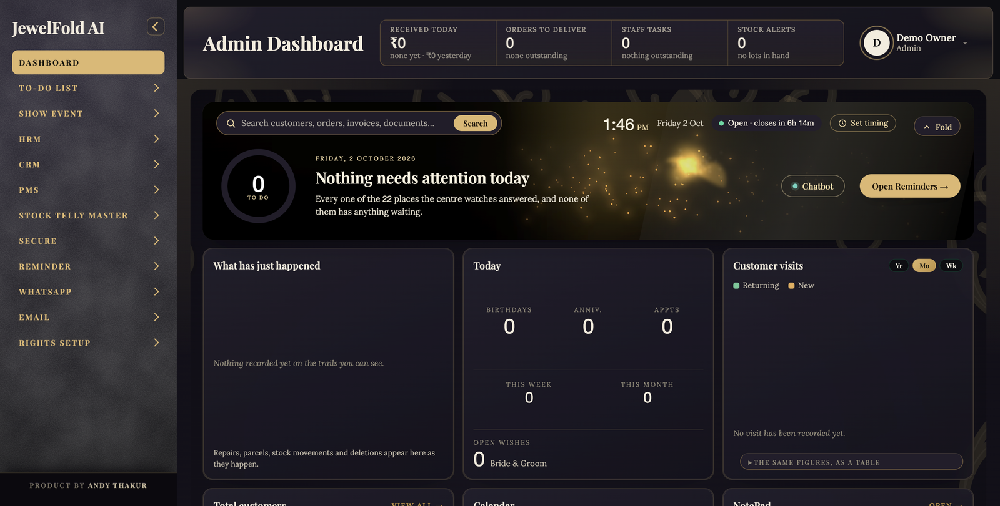

# JewelFold AI

**The complete back office for a jewellery shop.**

Customers, repairs, staff, stock, orders, reminders and WhatsApp — in one self-hosted system, built for jewellers.

&nbsp;

---

## See it live

The live band at the top of the dashboard. Its light reads the shop's alert centre: calm when nothing is waiting, and it changes colour and weather as work piles up or goes late. Drawn in real time in the browser, with no libraries.

## Why JewelFold AI

Most jewellery shops run on registers, spreadsheets and memory. JewelFold AI puts the whole back office in one place — and because it runs on **your own server or shop PC**, there is **no monthly fee**, no lock-in, and the shop's data never leaves the shop.

It was built inside a working jewellery shop, around how jewellers actually work: customer relationships, karigar repairs, occasions, approvals and trust.

## Screenshots

<table>
<tr>
<td width="62%"> <b>Dashboard</b> — today's work, birthdays, anniversaries and appointments, shop timing, and an AI assistant</td>
<td width="38%"> <b>Sign in</b> — every employee signs in with their own mobile number</td>
</tr>
</table>

## Features

| Area | What it covers |
|---|---|
| **Customers (CRM)** | Customer records with family, address, category and type · visit entries and a monthly visit report · birthday and anniversary lists · bride & groom wish list · ring and bangle sizes · appointments · delivery status · invoice due list · remarks report |
| **Repairs & couriers** | Repair tracking from received to ready-to-collect with a full trail · couriers sent and received · courier companies · shipments · home deliveries |
| **Staff (HRM)** | Employee register · attendance · leave with approve / reject · work assignment · interview candidates · holidays · bank details · printable ID cards |
| **Stock & packaging** | Stock lots with a stage-by-stage handover trail · package types and sizes · piece accounts with vendors |
| **Reminders & payments** | Reminder alerts by category · payment reminders · pending payments · orders · customer approvals |
| **WhatsApp & email** | WhatsApp chats, templates, contact lists and campaigns · bulk email |
| **Secure records** | Loyalty points (gold, diamond, polki, reference) · vehicle challans · legal documents with expiry dates · a recycle bin to restore anything deleted |
| **Control** | Rights Setup — choose exactly which screens each employee can open, and who may delete · shop timing and weekly off on the dashboard · built-in AI assistant in English and Hindi |

## Tech stack

- **Backend:** Node.js, Express, TypeScript
- **Views:** server-rendered EJS with a single tokenised stylesheet (dark "Midnight Velvet" theme)
- **Database:** Microsoft SQL Server 2019+ (the free Express edition is enough) — tables and stored procedures included, built with one command
- **Security:** bcrypt passwords, CSRF protection, sign-in rate limiting, per-screen access rights
- **Optional integrations:** Google Gemini (AI assistant), WhatsApp Business (messaging)

## What buyers get

- Full source code
- Every database table and stored procedure, with one-command setup (`node scripts/setup-database.js`)
- A first-administrator script (`node scripts/create-admin.js`)
- A step-by-step installation guide

Tested on a brand-new, empty SQL Server database: the schema builds completely, the first administrator signs in, and every admin screen opens.

## Get it

JewelFold AI is a commercial product, sold with a **one-shop licence**.

### 👉 [Buy JewelFold AI on Gumroad](https://andythakur.gumroad.com/l/jewelfold-ai)

## Licence

© 2026 Andy Thakur. All rights reserved.
The source code is not published in this repository. It is licensed for use in one shop per purchase; reselling or redistributing it is not allowed.

---

Product by <b>Andy Thakur</b>

